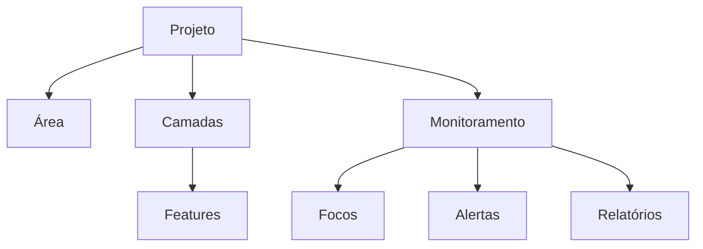

# TerraGuardXikrin

## Visão Geral

O TerraGuardXikrin é uma plataforma SIG (Sistema de Informação Geográfica) para monitoramento territorial, prevenção e resposta a incêndios florestais, análise ambiental e apoio à tomada de decisão.

A plataforma foi desenvolvida para funcionar com qualquer território, como:

- Terras Indígenas
- Unidades de Conservação
- Projetos REDD+
- Fazendas
- Municípios
- Estados

---

# Objetivos

- Monitorar focos de calor em tempo real.
- Integrar NASA FIRMS.
- Integrar INPE BDQueimadas.
- Integrar dados climáticos NASA POWER.
- Apoiar brigadas de combate.
- Gerar relatórios automáticos.
- Centralizar dados geográficos.

---

# Arquitetura Geral

---

# Arquitetura do Banco

## Projetos

Cada projeto representa um território monitorado.

Exemplos:

- TI Xikrin
- TI Trincheira Bacajá
- Projeto REDD X

---

## Área

Representa o limite oficial do projeto.

Contém:

- geometria
- área
- perímetro
- bbox
- buffers

---

## Camadas

Representa qualquer camada geográfica importada.

Exemplos:

- Aldeias
- Estradas
- Hidrografia
- Pontos de água
- Escolas
- Aceiros
- Vegetação
- Uso do solo

---

## Features

Representa cada feição individual de uma camada.

Exemplo:

Camada:

Aldeias

Features:

- Djudjeko
- Kateté
- Pykati

---

## Monitoramento

Responsável por:

- focos
- alertas
- histórico
- relatórios

---

# Arquitetura do Backend

FastAPI

SQLAlchemy

PostGIS

Pydantic

---

# Arquitetura do Frontend

Streamlit

Leaflet

Plotly

---

# Fluxo de Importação

Projeto

↓

Selecionar Camada

↓

Escolher Tipo

↓

Upload

↓

Validação

↓

Salvar PostGIS

↓

Calcular métricas

↓

Disponibilizar no mapa

---

# Integrações

NASA FIRMS

INPE BDQueimadas

NASA POWER

MapBiomas

IBGE

ANA

---

# Filosofia

Toda informação adicional é opcional.

A única camada obrigatória do sistema é:

Área Principal.

Todas as demais camadas são utilizadas automaticamente quando estiverem disponíveis.

---

# Status

Versão: 1.0

Situação:

Em desenvolvimento.